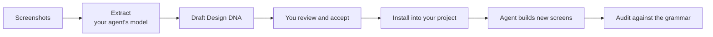
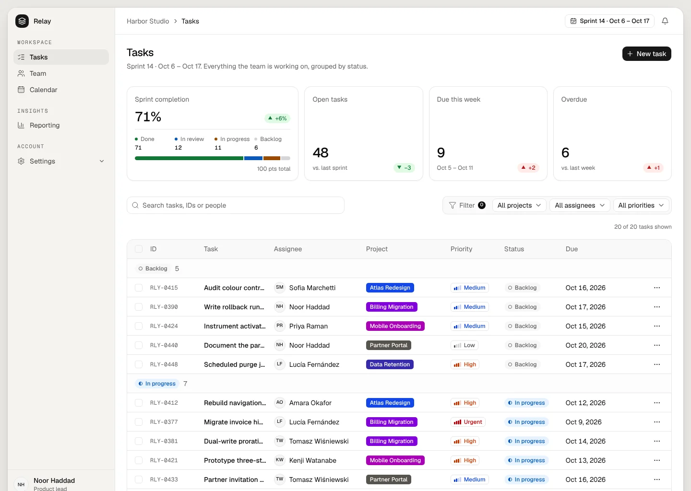
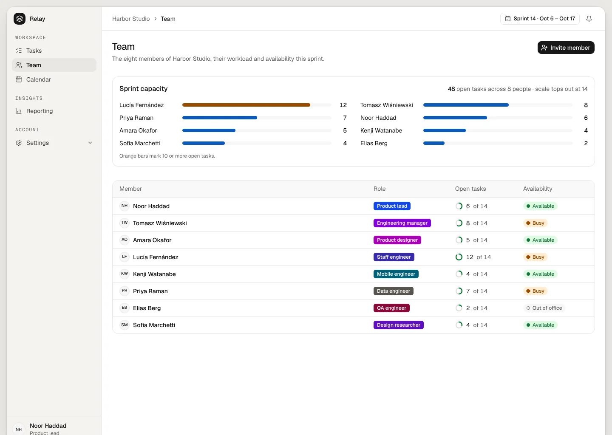
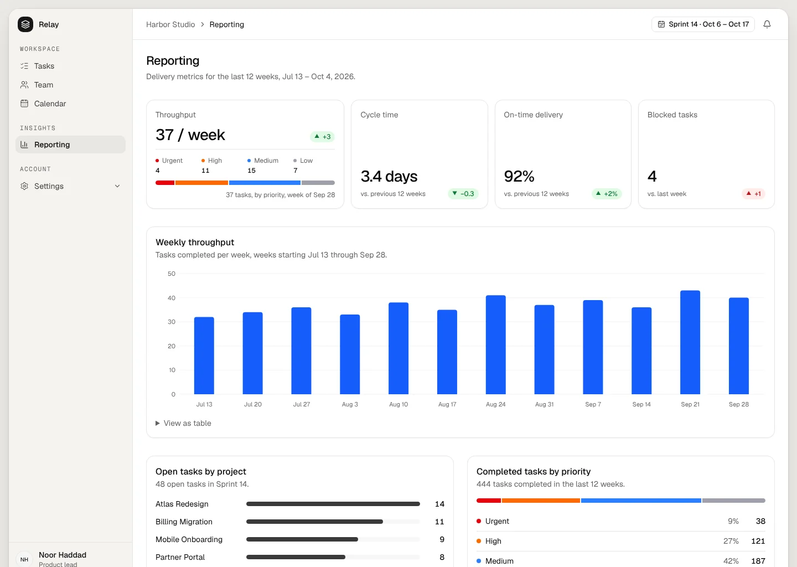
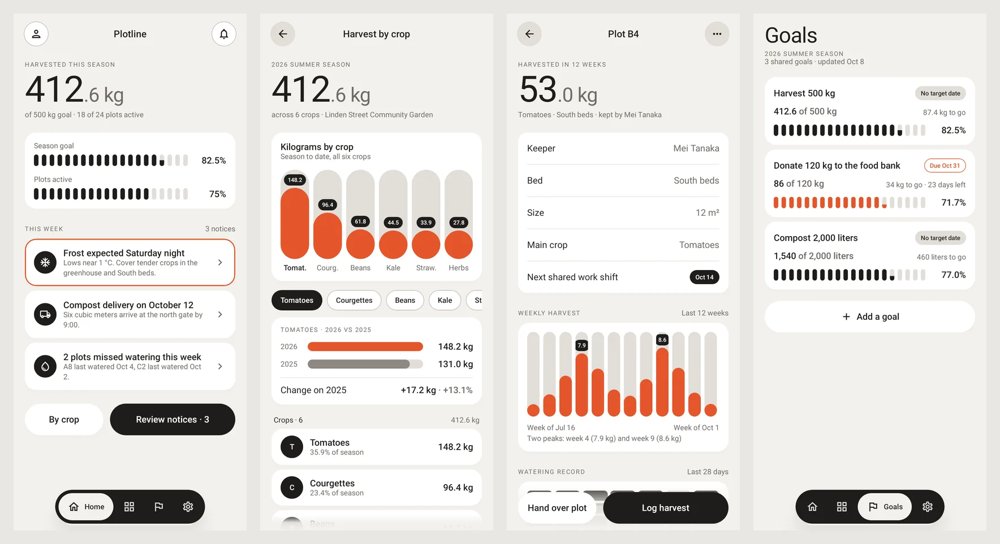
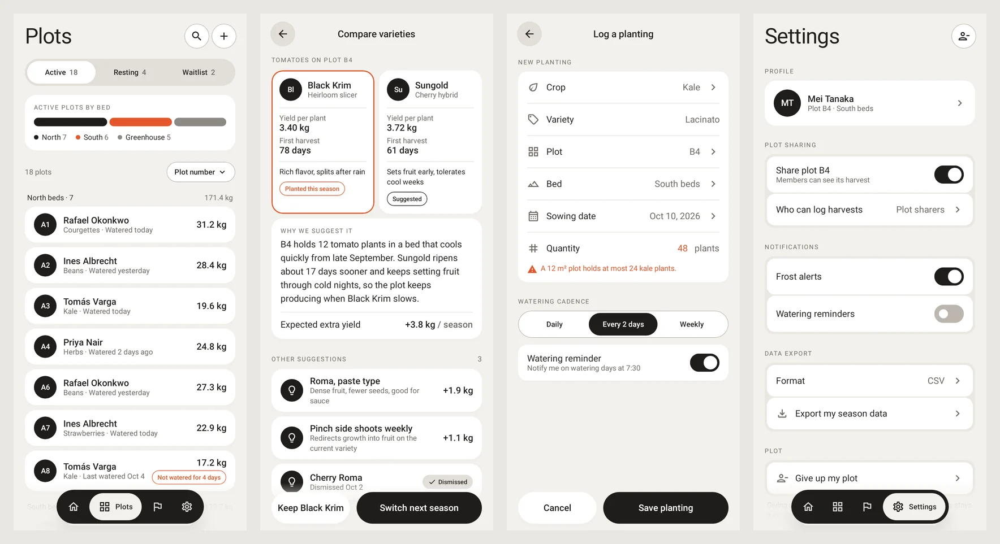

# Designome

<picture>
  <source media="(prefers-color-scheme: dark)" srcset="assets/brand/designome-lockup-on-dark.svg">
  
</picture>

**Turn UI screenshots into a design grammar your coding agent can follow.**

Designome studies screenshots of interfaces you admire and extracts what makes them well designed: hierarchy, proportions, rhythm, density, surface tiers, type roles, component anatomy and chart conventions. It turns those relationships into durable rules, installs them in your project, and checks that new screens follow them. Your product keeps its own content, brand and identity; it gains the same qualities.

Designome runs inside the coding agent you already use, Codex or Claude Code. The agent's own multimodal model reads the screenshots. Designome adds specialized prompts, versioned contracts and a deterministic Node runtime for validation, installation and audit.

## Why Designome

Coding agents can already turn a screenshot into code. What they struggle with is keeping one coherent design across many screens, sessions, real content and edge cases. Each new screen drifts a little.

Designome gives the agent a durable design contract instead of a picture to imitate:

- **Grammar, not copy.** It records the rule behind an element, such as "project icons are colored rounded-square tiles with a white glyph". It never records the logo, icon or illustration itself.
- **Rules that travel.** Rules are written to apply to screens the screenshots never showed, such as settings, tables or empty states.
- **Honest about evidence.** Every rule says whether it was seen, inferred, proposed or is unknown, so the agent never presents a guess as a fact.
- **Safe in your repository.** Generated files are checksum-managed, your overrides are preserved, and reinstalling changes nothing unless the guidance changed.

## How it works



1. **Extract.** Your agent analyses the screenshots through 13 specialist axes (layout, typography, color, components, data display, accessibility and more). It records each finding as a rule with its evidence.
2. **Review and accept.** You read the draft and accept it explicitly. This is the only human approval in the workflow.
3. **Install.** Designome writes a compact design brief, detailed topic files, a token CSS bridge and agent guidance into your project.
4. **Build.** Your agent reads the brief before generating UI, on any screen.
5. **Audit.** The audit skill compares rendered screens with the accepted rules. Mechanical, perceptual and usage results are kept separate.

## See it work

The screens below were built by a coding agent that **never saw the source screenshots**. It only read the compact design brief that Designome installed in the project.

- **Source:** four screenshots of a third-party HR performance-review dashboard. They are not reproduced here because they belong to their designer.
- **Extraction:** the `designome` skill turned them into a draft Design DNA in about 6.5 minutes for $1.58 at list price.
- **Generation:** a fresh agent got an ordinary request, "build the app in this brief", for a fictional project tool called Relay. The project guidance led it to the design brief. It built five routes in about 5.5 minutes for $1.01.
- **Content:** the product, people, projects and numbers are new. Only the grammar came from the source.



| Team                                                                                   | Reporting                                                                                        |
| -------------------------------------------------------------------------------------- | ------------------------------------------------------------------------------------------------ |
|  |  |

Rules the extraction recorded, and how they carried over:

- **Neutral canvas, color only in data.** Near-white surfaces; saturated color only in chips, tags, status marks and progress. Relay keeps the chrome black and white and colors only projects, priorities and statuses.
- **Summary row above a dense table.** One wider featured card with a breakdown, then equal cards with a large value and a signed delta. Relay's sprint completion card follows that anatomy.
- **Status by glyph, label and tint.** Every status pairs a hue, a mark and a word, never color alone.
- **Uniform compact rows with typed columns.** IDs, people, chips, rings, badges and dates each keep one cell type. The ID rule was recorded as a pattern, an uppercase prefix with a zero-padded number, so Relay uses `RLY-0415` rather than the source's IDs.

**Not carried over:** the source had no bar chart, so the DNA had no rule for chart marks, and the agent drew the Reporting bars as solid blocks with nothing to constrain them. One run, one model and one source; the [benchmark kit](benchmarks/next-shadcn/README.md) reruns this on your own screenshots.

### Mix the parts you like from several products

You can take the tables of one product, the charts of another and the theme of a third. Tell the agent which screenshot teaches what, and Designome keeps each one to its subjects.

The Android screens below were built in Kotlin and Jetpack Compose by an agent that only read the extracted brief:

- **Sources:** eight iOS screenshots from three unrelated apps, routed by subject. They are not reproduced here because they belong to their designers.
  - A subscription tracker set the base identity: colors, surfaces, type, charts, grouped lists and comparisons.
  - A password vault taught only forms, grouped cards and the navigation shell.
  - A health app taught only progress and status displays, without its colors or type.
- **Extraction:** about 11 minutes for $2.85 at list price. The run recorded every route it rejected, such as the vault's tile hues and the health app's green.
- **Generation:** a fresh agent built Plotline, a fictional community-garden app with nothing in common with the sources, in about 8 minutes for $1.43.





How the routes carried over:

- **Segmented progress from the health app, in the tracker's identity.** Goals, the home summary and the watering record use the segmented bars and grid, drawn in the tracker's ink and orange rather than the health app's green.
- **Forms and grouped cards from the vault.** "Log a planting" keeps the vault's label-left, value-right rows with leading icons inside one grouped card.
- **Type from the tracker only.** Large figures stay at regular weight with a smaller, lighter decimal part, and titles stay light.

**Not carried over yet:** the segmented bars use the darkest ink where the source kept it for the primary action and the active tab. The first run of this test also exposed a broader gap: rules written as adjectives, such as "weight used sparingly", let the agent fall back to bold text everywhere. Extraction now records a weight band per text role, ratios and an accent budget. Captures are JVM renders without system bars; the [Compose benchmark kit](benchmarks/compose-android/README.md) reruns the test on your own screenshots.

The same works on the web, with your own words. In a second test, a person said what they liked in two screenshots: the table of one product, and the sidebar, theme and layout of another. The extraction kept the first to tables. It needed one more sentence, "use it as the base for everything else", before it took cards, tiles and toggles from the second. See the [web routing evaluation](docs/web-routing-evaluation.md).

## What you get in your project

| Artifact                                             | Purpose                                                                                                  |
| ---------------------------------------------------- | -------------------------------------------------------------------------------------------------------- |
| `docs/designome/README.md`                           | The compact design brief: every signature quality, token, rule, component and unknown, read once in full |
| `docs/designome/` topic files                        | Evidence, coverage, per-domain recipes and governance, opened only when the detail is needed             |
| `.designome/design-dna.json`                         | The accepted Design DNA, the canonical machine-readable source                                           |
| `designome.generated.css`, `designome.overrides.css` | Managed token bridge next to your CSS entry, and a file you own for your adjustments                     |
| `AGENTS.md` and `CLAUDE.md` guidance block           | Tells Codex and Claude Code to read the brief before generating UI                                       |
| `.agents/skills/` and `.claude/skills/` audit skill  | Lets either host audit generated screens against the grammar                                             |

## Quick start

### 1. Install the skill

From your project, with Node.js 24 or newer:

```bash
npx skills@latest add https://github.com/jude-bayiha/designome --agent claude-code
# or
npx skills@latest add https://github.com/jude-bayiha/designome --agent codex
```

Designome is one skill, `designome`, with three operations: extract, install and audit. It ships its own runtime, prompts and schemas; nothing else needs to be installed. Claude Code can also install Designome as a plugin:

```text
/plugin marketplace add jude-bayiha/designome
/plugin install designome@designome
```

| Host        | Skill directory   | Invocation                                          |
| ----------- | ----------------- | --------------------------------------------------- |
| Claude Code | `.claude/skills/` | `/designome`, or `/designome:designome` as a plugin |
| Codex       | `.agents/skills/` | `$designome`                                        |

Name the operation in your request, as in the examples below; the skill reads only the instructions of that operation. Upgrading from a version with three skills? Remove `designome-extract`, `designome-install` and `designome-audit` from your skill directories, then install `designome`.

### 2. Extract the grammar

Ask your agent in plain language:

```text
/designome Extract the design grammar of these screenshots of a
project-management web app: ./refs/overview.png ./refs/tasks.png ./refs/details.png.
No motion.
```

You can route each screenshot to the subjects it should teach:

```text
/designome Extract for a corporate website.
Use dashboard-1.png only for statistics and charts.
Use theme.png only for colors and surfaces.
```

The agent writes a draft Design DNA and a readable summary of its rules, coverage and unknowns. Run artifacts stay local and are ignored by git.

### 3. Review and accept

Read the signature qualities, the rules and the unknowns, then tell your agent explicitly that you accept the draft. Nothing is installed before that.

### 4. Install

```text
/designome Install the accepted Design DNA in this project.
```

Designome detects your styling stack (plain CSS, Tailwind or shadcn/ui), shows a dry run, and then writes the managed files transactionally. If anything fails, it rolls back.

### 5. Build and audit

Ask your agent for new screens as usual; the installed guidance makes it read the brief first. Then:

```text
/designome Audit the new settings screen against the design grammar.
```

## Principles

- **Screenshots are the only source of visual truth.** Your project's existing CSS, components or UI never become evidence for the extracted grammar.
- **One status per claim.** The status tells the agent how far a rule can be trusted:

  | Status     | Meaning                                                                    |
  | ---------- | -------------------------------------------------------------------------- |
  | `observed` | Directly visible in a screenshot, with the region that shows it            |
  | `inferred` | The best explanation of repeated visible evidence                          |
  | `proposed` | A useful rule the screenshots do not show, such as an empty or error state |
  | `unknown`  | Not established; the agent must not invent it                              |

- **Static images prove appearance, not behavior.** Motion, responsiveness, accessibility semantics and runtime states stay `proposed` or `unknown` until they are verified.
- **Measurable beats vague.** "Bars are hairline strokes at most 4 px wide" survives a new screen; "bars are thin" often does not.
- **You stay in control.** The single human approval is acceptance. Generated files, your overrides and the guidance block stay separate, and managed files are checksum-tracked so manual edits are detected, never overwritten.

## What Designome is not

- **Not screenshot-to-code.** It does not reproduce the source screen, its logo, icons, copy or data.
- **Not a computer-vision pipeline.** There is no OCR, model training or pixel sampling; your agent's model does the visual reasoning.
- **Not a page generator.** It does not invent page families, roles or flows the screenshots do not show.
- **Not a browser.** The audit plans captures and evaluates evidence; your agent's browser or your project's Playwright records it.

## Evidence so far

- **Next.js and shadcn/ui test:** agents that only had the compact brief, and never saw the screenshots, kept the source's palette, surface tiers, card anatomy and chart conventions across five new screens. Their clearest miss came from a rule phrased as an adjective: "thin chart bars" became thick bars. See the [Next.js and shadcn/ui evaluation](docs/next-shadcn-evaluation.md) and rerun it on your own screenshots with the [benchmark kit](benchmarks/next-shadcn/README.md).
- **Kotlin and Jetpack Compose test:** with eight screenshots from three products routed by subject, an agent that only had the brief applied each source to its subjects on an unrelated Android app. Before extraction recorded weight bands, the same test produced bold text where the sources used regular weight. See the [Compose benchmark kit](benchmarks/compose-android/README.md).
- **Web routing test:** a person's plain-language wishes per screenshot became the right routing, once one screenshot was named as the base. See the [web routing evaluation](docs/web-routing-evaluation.md).
- **Token cost:** the brief entry point fell from a 3.1 MB dossier to about 15k tokens, and extraction took 15 instead of 24 minutes in the same test.
- **Earlier runs:** see the [executed fidelity evaluation](docs/fidelity-evaluation.md) and the [v0.3 forward test](docs/v0.3-forward-test.md).
- **Current focus:** making every signature quality carry a measurable bound, and evaluating on new products with their own content and brand.

## Working from this repository

Requirements: Node.js 24+ and pnpm 11.5.2.

```bash
pnpm install
pnpm check            # format, lint, contract validation, skill bundles, tests
pnpm designome --help
```

`designome run` drives the whole workflow from a workspace. It stops at each step that belongs to your agent or to you, then resumes where it left off:

```bash
pnpm designome run --source /abs/ref.png --project /abs/app --workspace /abs/ws
pnpm designome run --resume --workspace /abs/ws              # after the draft DNA is written
pnpm designome run --resume --workspace /abs/ws --accept-dna # your acceptance
```

Other commands include `doctor` (a read-only diagnostic), `install`, `audit`, `matrix-brief`, `expand-dna` and `validate-dna`. See [Runtime and CLI](docs/runtime.md).

## Documentation

- **Understand:** [product foundation](docs/product-foundation.md), [architecture and methodology](docs/architecture-and-methodology.md), [concept matrix](docs/concept-matrix.md).
- **Use:**
  - [conversational requests](docs/conversational-request-contract.md)
  - [installation contract](docs/installation-contract.md)
  - [transactional installation and doctor](docs/transactional-installation.md)
  - [integration and calibration](docs/integration-and-calibration-matrix.md)
  - [skill distribution](docs/skill-distribution.md)
  - [runtime and CLI](docs/runtime.md)
- **Verify:**
  - [fidelity contract](docs/fidelity-contract.md)
  - [audit contract](docs/audit-contract.md)
  - [browser evidence adapter](docs/browser-evidence-adapter.md)
  - [benchmark workflow](docs/fidelity-benchmark.md)
  - [orchestration and host contract](docs/orchestration-and-host-contract.md)
- **Experimental:** [lossless context compiler](docs/lossless-context.md) and its [non-regression assessment](docs/context-non-regression.md).
- **Examples:** [Design DNA v0.3](examples/design-dna.reference-v0.3.json) and [reference screenshot analysis](docs/reference-analysis.md).

## Repository layout

```text
skill-sources/    Canonical skill instructions, workflows and contracts
skills/designome/ Generated standalone skill bundle (do not edit by hand)
prompts/          Specialized extraction, synthesis, integration and audit prompts
concepts/         Versioned concept matrix: axes, facets, concepts, UI domains
schemas/          JSON Schemas for every contract
src/runtime/      Deterministic runtime: validation, installation, audit
bin/              designome CLI
docs/             Product, contracts and evaluations
examples/         Schema-valid reference artifacts
benchmarks/       Reusable generation benchmarks
scripts/, tests/  Repository validation and tests
.codex-plugin/    Codex plugin manifest
.claude-plugin/   Claude Code plugin and marketplace manifests
```

## Contributing

Read [AGENTS.md](AGENTS.md) first: it states the product philosophy and the working rules for people and agents. Use Conventional Commits, run `pnpm check`, and deliver every change through a pull request. Husky formats staged files and checks commit messages, CI runs the same checks, and Release Please prepares releases from `main`.
