# Architecture and methodology — Designome v0.2

## Architecture principles

- The host coding agent performs multimodal reasoning; Designome supplies contracts and workflow.
- Screenshots remain immutable inputs and the only source of visual truth.
- Every artifact is serializable, versioned, and traceable to a prompt stage.
- Observations, inferences, proposals, and unknowns never share a status.
- Framework-neutral extraction is separate from target-specific installation.
- Generated content is replaceable; human overrides are preserved.
- Missing evidence produces an unknown or proposal, never a fabricated observation.
- Deterministic runtime work, host-agent reasoning, browser execution, and human acceptance use explicit persisted handoffs.

## Modular pipeline

```mermaid
flowchart LR
    A["designome run"] --> B["Doctor and run initialization"]
    B --> C["Host-agent screenshot extraction"]
    C --> D["02-09 Eight axis analyses"]
    D --> E["10 Synthesis"]
    E --> F["Human acceptance"]
    F --> G["Transactional installation"]
    G --> H["Host-agent UI task"]
    H --> I["Host browser plus capture adapter"]
    I --> J["Four-layer audit"]
    J --> K["Consolidated result"]
```



`00-orchestrator.md` validates inputs and routes stages. It does not perform every analysis itself. Each stage reads the shared contract, its matrix slice, and the minimum upstream artifacts it needs.

## Stage responsibilities

| Stage                         | Responsibility                                               | Main output                                         |
| ----------------------------- | ------------------------------------------------------------ | --------------------------------------------------- |
| 00 Orchestrator               | Persist state, route owners, pause, resume, and report       | `run-plan.json`, `workflow-state.json`              |
| 01 Source evidence            | Inventory screenshots and stable evidence regions            | source manifest and evidence index                  |
| 02 Perceptual foundations     | Composition, rhythm, hierarchy, visual language              | axis fragment                                       |
| 03 Task architecture          | Orientation, priority, disclosure, context                   | axis fragment                                       |
| 04 Interactions and states    | Controls, business states, feedback, optional motion         | state fragment and coverage table                   |
| 05 Business and data patterns | Components, tables, forms, filters, data scale               | pattern fragment                                    |
| 06 Adaptation and inclusion   | Reflow, localization, modalities, accessibility implications | adaptation fragment                                 |
| 07 Performance and resilience | Loading, stability, degradation, recovery                    | resilience fragment                                 |
| 08 Content, trust, privacy    | Language, consequences, provenance, permissions              | content fragment                                    |
| 09 System and governance      | Tokens, contracts, exceptions, enforcement                   | governance fragment                                 |
| 10 Synthesis                  | Resolve claims into one canonical contract                   | `design-dna.json` and reports                       |
| 11 Integration                | Diagnose and install accepted artifacts transactionally      | managed files, manifest, transaction result         |
| 12 Generation audit           | Plan adapter capture and four independent audit layers       | evidence, canonical report, findings, and proposals |

## Evidence and claim model

Every canonical claim contains:

- a stable ID and one testable statement;
- matrix concept references;
- one epistemic status;
- confidence score and basis;
- evidence references when observed or inferred;
- explicit scope and exceptions;
- an implementation validation method and status.

Confidence and status are independent. A direct observation can have low confidence because of crop or compression. An unknown can have high certainty because the relevant state is absent.

Accepted range values may add a preferred implementation value and either a `bounded` or `audit-only` strategy. This makes forward-test calibration executable without reclassifying a human preference or computed implementation value as screenshot evidence.

## Status promotion

| Status     | Admission rule                                                                        | Promotion path                                 |
| ---------- | ------------------------------------------------------------------------------------- | ---------------------------------------------- |
| `observed` | Directly visible or explicitly supplied; localized evidence required                  | Remains scoped to its evidence                 |
| `inferred` | Best explanation of repeated visible relationships; evidence and uncertainty required | Human review or further evidence               |
| `proposed` | Useful behavior or rule absent from the screenshots                                   | Forward test and explicit acceptance           |
| `unknown`  | Insufficient evidence for a defensible claim                                          | New evidence or an authorized product decision |

Synthesis may merge compatible claims and preserve scoped exceptions. It must expose contradictions and may never promote status merely because several prompts repeated the same unsupported idea.

## Motion modes

- `off`: no motion output.
- `observed-only`: retain motion only when the user supplies a sequence, recording, specification, or implementation evidence.
- `auto`: propose functional motion where it clarifies state or spatial continuity.

Static screenshots never establish timing, easing, path, interruption, or reduced-motion behavior. In `auto`, those rules remain `proposed` and must be functional, interruptible, layout-stable, and compatible with `prefers-reduced-motion`.

## Extraction and installation boundary

Extraction may run without a target project. When a target path is supplied, the integration stage may inspect:

- package manager and framework;
- source and CSS entry points;
- aliases and build scripts;
- installed icon or motion libraries;
- applicable repository and nested agent instructions;
- declared existing design-documentation paths and precedence;
- styling-system dependencies and directives such as Tailwind.

It may not treat existing CSS, components, tokens, or rendered UI as Design DNA evidence. Technical compatibility can change the export shape, never the extracted design meaning.

## Run artifacts

```text
.designome/runs/<run-id>/
├── run-plan.json
├── workflow-state.json
├── source-manifest.json
├── evidence-index.json
├── stages/
│   ├── 02-perceptual-foundations.json
│   └── ...
├── design-dna.json
├── design-rules.md
├── confidence-report.md
├── unknowns.md
├── integration-plan.json
├── docs/designome/ (or a repository-configured target directory)
│   ├── README.md
│   ├── foundations/ (5 documents)
│   ├── components/ (6 documents)
│   ├── behavior/ (6 documents)
│   └── governance/ (5 documents)
└── audit/
    ├── plan.json
    ├── evidence.json
    ├── report.json
    ├── report.md
    └── findings.json
```

Run artifacts are local working evidence and should not be committed by default. Accepted, sanitized outputs may be promoted deliberately.

## Validation layers

1. **Structural:** JSON Schema, JSON parsing, matrix references, prompt headings, and workflow YAML.
2. **Semantic:** claim evidence, status rules, concept coverage, conflicts, and unresolved unknowns.
3. **Installation:** read-only doctor, transactional preflight, checksums, rollback, manifest integrity, and second-run no diff.
4. **Mechanical:** rendered geometry and objective browser measurements.
5. **Perceptual:** explicitly host-agent evaluation with provenance, certainty, and limitations.
6. **Usage:** executed interactions, keyboard, focus, accessibility semantics, responsive scenarios, localization direction, and recovery.

Reports must state which layers actually ran. Static inspection is not rendered or interaction proof.

Rendered measurements are normalized through the [audit contract](audit-contract.md). Observed implementation risks, accepted Design DNA deviations, and proposed calibration candidates remain separate result classes.

## Repository dependency rule

The concept matrix and Design DNA schema are canonical contracts. Prompts consume them. The installer consumes only accepted Design DNA. Audits consume accepted Design DNA plus implementation evidence. No artifact may silently become a new source of visual truth.

## Executable runtime boundary

The plugin packages three compatible agent entry points plus one orchestrated CLI:

- `designome-extract` performs multimodal evidence and synthesis work;
- `designome-install` reviews technical compatibility and invokes managed installation;
- `designome-audit` separates static, rendered, interaction, and accessibility evidence.
- `designome run` coordinates those responsibilities through persistent resumable state without duplicating their visual reasoning or installation logic.

The dependency-light Node runtime performs only deterministic work:

- PNG, JPEG, GIF, and WebP metadata plus SHA-256 hashing;
- idempotent run initialization and input fingerprinting;
- semantic Design DNA reference and evidence checks;
- CSS entry discovery or explicit selection;
- generated CSS, user-owned overrides, and managed `AGENTS.md` blocks;
- a matrix-projected 23-file design dossier and styling-adapter context;
- audit configuration validation, browser-provider resolution, and evidence artifact initialization;
- official browser evidence normalization and provider-state validation;
- transactional manifest checksums, conflict diagnostics, interruption recovery, rollback, and verification.

The runtime cannot interpret screenshot design intent. Skills cannot bypass runtime ownership checks. This boundary keeps model reasoning flexible and file mutation predictable.
