# Architecture and methodology — Designome v0.3

## Architecture principles

- The host coding agent performs multimodal and perceptual reasoning; Designome supplies versioned contracts, specialized prompts, and deterministic workflow.
- Screenshots are immutable inputs and the only source of visual truth.
- Every claim has exactly one status: `observed`, `inferred`, `proposed`, or `unknown`.
- Evidence, confidence, scope, exceptions, screenshot limits, and validation survive every stage.
- Framework-neutral extraction is separate from target-specific installation.
- A target project is a technical destination, never Design DNA evidence.
- Missing evidence produces explicit coverage gaps, not fabricated completeness.
- Natural language is normalized once into a validated contract before specialist routing.
- Host reasoning, deterministic runtime work, human acceptance, implementation, and browser execution use explicit persisted handoffs.
- Generated artifacts are checksum-managed; human overrides remain separate.

## Modular pipeline

```mermaid
flowchart LR
    A["Conversation and screenshots"] --> B["Request contract v1.1"]
    B --> C["Runtime validation and run initialization"]
    C --> D["01 Source evidence, classification, compatibility, routing"]
    D --> E["02-14 Routed specialist axes, five facets each"]
    E --> F["15 Canonical synthesis and complete coverage"]
    F --> G["Human acceptance"]
    G --> H["16 Transactional project integration"]
    H --> I["Host-agent implementation"]
    I --> J["Host browser and evidence adapter"]
    J --> K["17 Four-layer generation audit"]
```



`00-orchestrator.md` normalizes intent, validates the request, creates the run plan, and routes work. It does not duplicate specialist analysis. `01-source-evidence.md` decides which visible regions are admitted to which axes and UI domains. The 13 axis prompts inspect five stable facets each. `15-synthesis.md` is the only stage allowed to resolve fragments into canonical Design DNA.

## Stage responsibilities

| Stage                                   | Responsibility                                                                                           | Main output                                           |
| --------------------------------------- | -------------------------------------------------------------------------------------------------------- | ----------------------------------------------------- |
| 00 Orchestrator                         | Normalize conversation, validate paths/scope, plan routing, persist handoffs                             | request contract, run plan, workflow state            |
| 01 Source evidence                      | Describe visible regions, classify surfaces, detect UI domains, enforce directives, assess compatibility | evidence index, compatibility report, routed evidence |
| 02 Spatial composition                  | Regions, grids, rhythm, alignment, density, depth                                                        | five-facet axis fragment                              |
| 03 Typography/content hierarchy         | Type roles, readability, numeric treatment, wrapping, truncation                                         | five-facet axis fragment                              |
| 04 Color/surface/identity               | Semantic color, themes, surfaces, shape, icons, imagery, brand                                           | five-facet axis fragment                              |
| 05 Component morphology                 | Anatomy, variants, states, composition, constraints, anti-patterns                                       | typed component fragment                              |
| 06 Navigation/task architecture         | Orientation, hierarchy, priorities, disclosure, continuity                                               | five-facet axis fragment                              |
| 07 Forms/input workflows                | Labels, controls, validation, formatting, save/recovery, sensitive data                                  | five-facet axis fragment                              |
| 08 Data display/visualization           | KPIs, context, tables, charts, scales, uncertainty, alternatives                                         | five-facet axis fragment                              |
| 09 Interaction/state/motion             | States, triggers, feedback, exits, focus, modalities, motion                                             | five-facet axis fragment                              |
| 10 Responsive/platform adaptation       | Reflow, containers, mobile/native shell, orientation, input conventions                                  | five-facet axis fragment                              |
| 11 Accessibility/inclusion/localization | Semantics, order, contrast, zoom, modality, localization, verification                                   | five-facet axis fragment                              |
| 12 Content/trust/ethics                 | Voice, actionability, provenance, permission, consequence, informed choice                               | five-facet axis fragment                              |
| 13 Performance/resilience               | Loading, stability, scale, degradation, work preservation, recovery                                      | five-facet axis fragment                              |
| 14 System/governance                    | Tokens, contracts, provenance, coverage, integration, non-regression                                     | five-facet axis fragment                              |
| 15 Synthesis                            | Resolve duplication/conflict and materialize the canonical grammar                                       | Design DNA, rules, confidence, unknowns, coverage     |
| 16 Integration                          | Diagnose and install accepted artifacts transactionally                                                  | managed dossier, CSS bridge, manifest, verification   |
| 17 Generation audit                     | Evaluate accepted grammar against real implementation evidence                                           | canonical report, findings, repair proposal           |

## Evidence and source-routing model

Every source has:

- stable identity, kind, dimensions/hash, limitations, and path;
- evidence-backed surface/archetype classification with confidence and basis;
- detected UI domains;
- the normalized per-source directive that controls evidence admission.

Every evidence region has a visible summary, source reference, limitations, concepts, and UI domains. Visible summaries do not contain interpretations. Claims refer back to these region IDs.

The directive modes are:

- `all`: all visibly supported subjects;
- `only`: selected axes, concepts, domains, token categories, or rule categories only;
- `prefer`: selected subjects receive priority without hiding other visible evidence;
- `exclude`: selected subjects are prohibited.

Source routing is applied before each specialist sees evidence. It therefore supports using two dashboard captures only for statistics while using a third capture only for color and surface treatment.

## Destination compatibility

The optional use-case sentence never rewrites source truth. Direct mode requires representative destination-family evidence before destination-specific accuracy is claimed. Adapt mode permits transfer while preserving every absent destination pattern as `proposed`.

Examples:

- dashboard references can establish KPI/chart grammar but not corporate marketing composition;
- a website capture can establish visible web hierarchy but not mobile-native safe-area or gesture behavior;
- a narrow screenshot does not prove native mobile solely from its dimensions;
- unrecognized optional text is ignored and recorded rather than interpreted creatively.

The compatibility report keeps matching evidence, transferable scoped evidence, missing source families, and proposed adaptation separate.

## Canonical claim model

Every token, rule, and component claim contains:

- a stable ID and testable statement;
- concept and UI-domain routing;
- exactly one epistemic status;
- confidence score and basis;
- evidence references for `observed` and `inferred`;
- scope and exceptions;
- validation method and status.

Confidence and status are independent. A direct observation may have low confidence because of crop or compression. An `unknown` can be certain because the relevant behavior is absent.

Tokens add semantic role, applicable targets, relationships, and an exact/range/relationship/unknown value. Exact values require defensible evidence. Bounded preferred values may be used for forward-test calibration without being promoted to observed.

Rules add category, strength, requirements, applicable targets, rationale, failure modes, dependencies, and validation cases.

Components add:

- purpose and UI-domain routing;
- typed anatomy with required/optional/conditional parts;
- variants with purpose, conditions, differences, status, and evidence;
- state contracts with trigger, behavior, feedback, exit/recovery, programmatic state, validation, and evidence;
- composition, content, adaptation, accessibility, and anti-pattern contracts;
- token/rule references and one evidence-backed canonical claim.

## Status admission and promotion

| Status     | Admission rule                                                                        | Promotion path                                 |
| ---------- | ------------------------------------------------------------------------------------- | ---------------------------------------------- |
| `observed` | Directly visible or explicitly supplied; localized evidence required                  | Remains scoped to that evidence                |
| `inferred` | Best explanation of repeated visible relationships; evidence and uncertainty required | Human review or further evidence               |
| `proposed` | Useful destination, resilience, or implementation contract absent from screenshots    | Forward test and explicit acceptance           |
| `unknown`  | Insufficient evidence for a defensible claim                                          | New evidence or an authorized product decision |

Repeated unsupported statements never increase status. Synthesis merges compatible claims, retains scoped exceptions, exposes conflicts, and rejects evidence leakage.

## Complete coverage model

Design DNA v0.3 contains:

- 13 axis coverage entries;
- exactly five facet entries per axis, for 65 total;
- 20 UI-domain coverage entries.

Each facet record carries coverage status, epistemic status, summary, evidence/artifact references, gaps, and validation. Each domain record adds applicability. Unsupported specialist questions stay visible as `unknown`; non-detected and irrelevant UI domains can be `not-applicable`.

Coverage completeness is structural honesty, not a claim that a static screenshot proved interaction, accessibility, responsiveness, data meaning, performance, or runtime behavior.

## Motion modes

- `off`: no motion output.
- `observed-only`: retain motion only from a sequence, recording, explicit specification, or implementation evidence.
- `auto`: propose functional motion for state or spatial continuity.

Static screenshots never establish duration, easing, path, interruption, or reduced-motion behavior. Auto-mode motion remains `proposed`, interruptible, layout-stable, and compatible with reduced motion.

## Extraction and installation boundary

Extraction may run without a target. Integration can inspect only technical facts:

- package manager, framework, source roots, aliases, and scripts;
- CSS entry and styling system;
- already installed technical libraries;
- applicable repository instructions;
- declared existing design-documentation paths and precedence.

Existing CSS, components, tokens, documentation, or rendered target UI cannot support a Design DNA visual claim. They affect adapter shape only.

## Run and installed artifacts

```text
.designome/runs/<run-id>/
├── request-contract.json
├── run-context.json
├── run-plan.json
├── workflow-state.json
├── source-manifest.json
├── evidence-index.json
├── compatibility-report.json
├── stages/
│   ├── 02-spatial-composition.json
│   ├── ...
│   └── 14-system-governance.json
├── design-dna.json
├── design-rules.md
├── confidence-report.md
├── unknowns.md
├── coverage-report.md
└── audit/
    ├── plan.json
    ├── evidence.json
    ├── report.json
    ├── report.md
    └── findings.json
```

An accepted installation projects 52 documentation files:

```text
docs/designome/
├── README.md
├── foundations/ (7)
├── components/ (6)
├── patterns/ (20)
├── behavior/ (11)
└── governance/ (7)
```

The project also receives the accepted Design DNA, namespaced token CSS, a user-owned override file, project-local audit skill, managed guidance, manifest, and user-owned audit configuration.

Run artifacts are local evidence and are not committed by default. Accepted sanitized outputs may be promoted deliberately.

## Validation layers

1. **Structural:** JSON Schema, parsing, exact matrix cardinality, cross-references, prompt structure, and skill metadata.
2. **Semantic:** status/evidence rules, typed artifacts, dependencies, exact axis/facet/domain coverage, and unresolved unknowns.
3. **Installation:** read-only doctor, dry-run, staging, journal, atomic apply, checksums, rollback, manifest integrity, and second-run no diff.
4. **Mechanical:** geometry, overflow, clipping, measurable constraints, and console evidence.
5. **Perceptual:** host-agent comparison with provenance, certainty, source/target captures, and limitations.
6. **Usage:** executed interactions, keyboard/focus, accessibility semantics, responsive scenarios, directions, states, and recovery.

Reports state which layers ran. Static inspection is not rendered, interaction, accessibility, or perceptual proof.

## Executable runtime boundary

The dependency-light Node runtime performs only deterministic work:

- image metadata and hashes;
- request/Design DNA validation and input fingerprinting;
- explicit run-plan routing metadata;
- installation planning, rendering, staging, journaling, atomic writes, checksums, rollback, and verification;
- projection of the 52-file dossier;
- audit planning, evidence normalization, and result evaluation.

The host agent performs screenshot reasoning, writes evidence and Design DNA, implements the target UI, drives an available browser, and records perceptual observations. The human accepts the draft Design DNA. These ownership boundaries are never collapsed.
