# Web routing evaluation

Evaluation recorded on 2026-10-08 and 2026-10-09. It tests whether a person can say in their own words what they like in each screenshot, without naming evidence modes, and whether the extraction turns those words into the right per-source routing. It also tests whether a web app generated from the routed dossier follows that routing. It is a scoped host-agent experiment with one or two runs per arm, and its draft Design DNA was never accepted. The protocol, prompts, scripts and rubric are in [`benchmarks/next-shadcn/`](../benchmarks/next-shadcn/README.md).

**Observed:** a screenshot described only by what the person likes is routed `only` to those subjects. Adding one sentence that names it as the base for everything else routes it `prefer`. The screenshot meant for tables stayed limited to tables in both runs, and its accent color appeared nowhere in the generated apps.

**Inferred:** to mix products, name one screenshot as the base. Otherwise every subject that no screenshot was explicitly given, such as cards, figure tiles or toggles, stays `unknown`, and the generator invents it.

## Setup

- **Sources:** two web screenshots from two unrelated products, kept out of the repository because they belong to their owners.
  - A project-management list view. The person liked its table: open rows instead of a boxed grid, icons inside cells, and small, fine text matched to that layout.
  - An automation dashboard. The person liked its sidebar, its light theme and its layout: sidebar, top bar, and content framed with space around it.
- **Routing:** the person's own sentences, in French, passed verbatim as the routing file. The English rendering is [`routing.example.md`](../benchmarks/next-shadcn/prompts/routing.example.md).
- **Target:** Cabinet, a fictional collections registry for a natural-history museum, in Next.js with shadcn/ui. Its domain is unrelated to both sources. Five routes: objects, loans, calendar, reporting and settings.
- **Check:** [`check-routing.mjs`](../benchmarks/shared/check-routing.mjs) compares each extraction's request contract with the routing expected from the sentences.

## Results

| Run       | Routing words for the dashboard                         | Table source | Dashboard source | Domains left `unknown`                                 |
| --------- | ------------------------------------------------------- | ------------ | ---------------- | ------------------------------------------------------ |
| Extract 1 | What the person likes, alone                            | `only`       | `only`           | Cards, figure tiles, actions, status, search, settings |
| Extract 2 | The same, plus "use it as the base for everything else" | `only`       | `prefer`         | Notifications only                                     |

Both extractions recorded their reading in the request contract. Extract 1 noted that the person never wrote "only" and routed each source to the subjects they named. Extract 2 admitted the color axis on the table source for icon color only, and kept color roles, theme and surfaces out of it.

What the generated apps showed:

- **Tables, in every run:** open rows with one hairline separator, rows grouped under a colored status pill with a muted count, a muted outline icon in empty date and priority cells, a closing "add" row, and small regular-weight text. No accent color came from the table source.
- **Shell, in every run:** a sidebar with grouped sections and count badges, a top bar, and content framed in rounded panels with space around them.
- **Base, only after extract 2:** black toggles, figure tiles with a leading icon, small integration cards with a colored status dot, and dotted-circle section marks in the sidebar. After extract 1, the same places used generic or invented treatments.

## Captures

Every capture is the first screen at 1440 × 1024, rendered at 2x. The two dossier columns show run 1 of each extraction; the screenshot column shows the screenshot arm with the base sentence. The arms never saw each other's output.

### Objects

| Dossier, words only                                                                                                 | Dossier, with the base sentence                                                                                                | Screenshots, with the base sentence                                                                |
| ------------------------------------------------------------------------------------------------------------------- | ------------------------------------------------------------------------------------------------------------------------------ | -------------------------------------------------------------------------------------------------- |
| 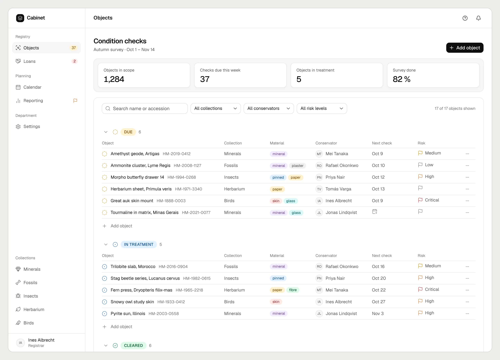 | 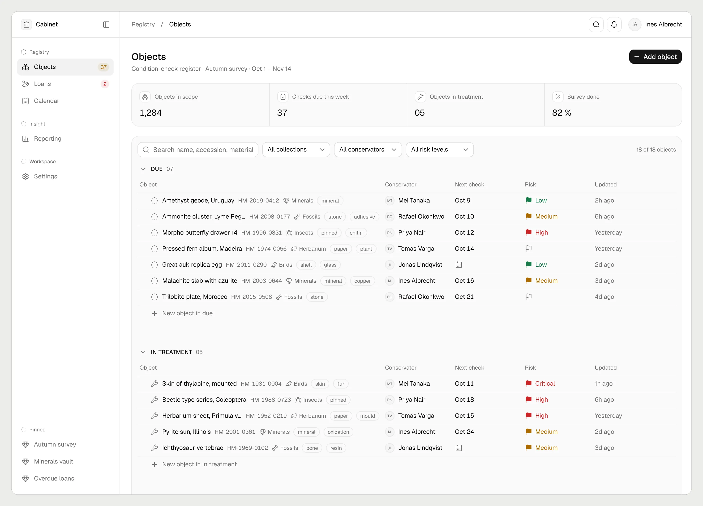 | 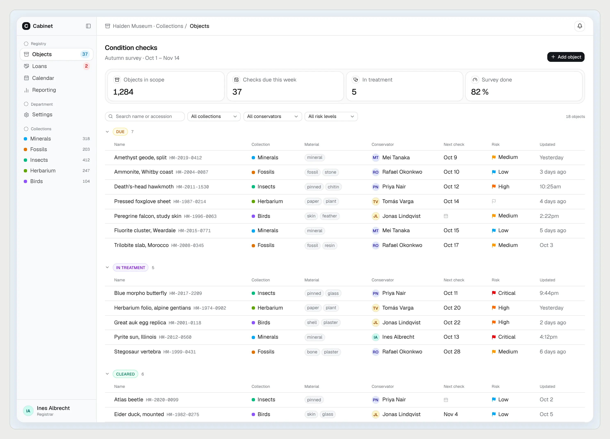 |

### Loans

| Dossier, words only                                                                                             | Dossier, with the base sentence                                                                                            | Screenshots, with the base sentence                                                            |
| --------------------------------------------------------------------------------------------------------------- | -------------------------------------------------------------------------------------------------------------------------- | ---------------------------------------------------------------------------------------------- |
| 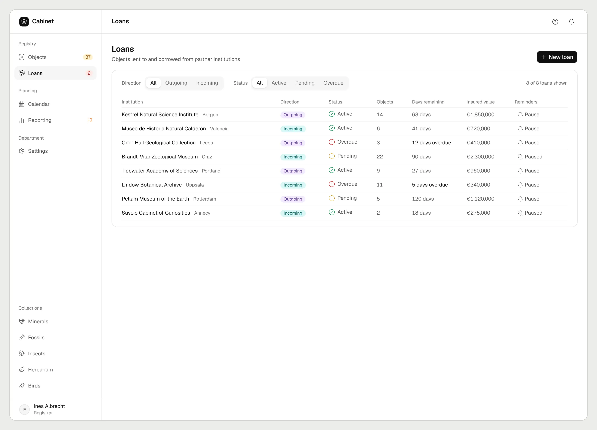 | 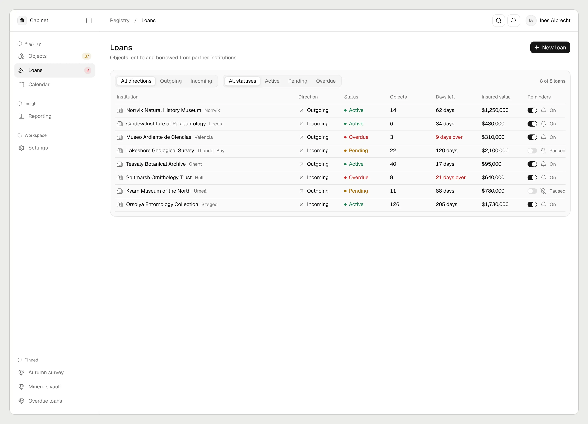 | 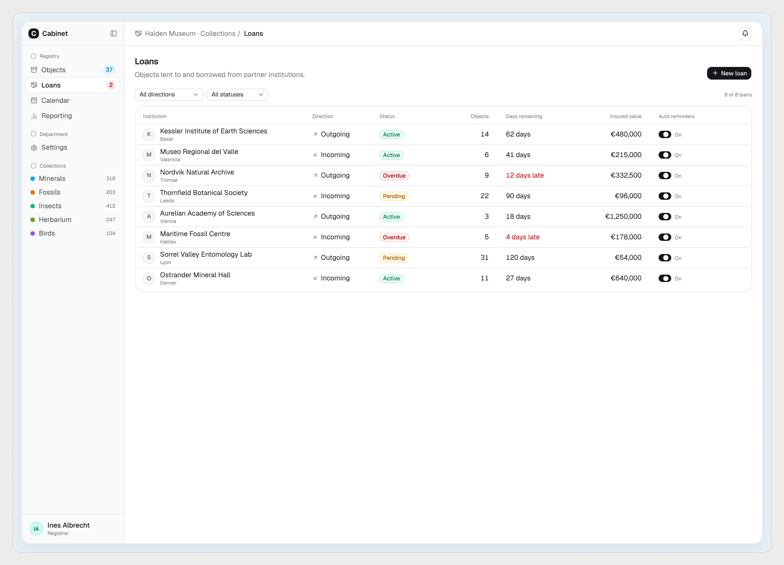 |

### Reporting

| Dossier, words only                                                                                                     | Dossier, with the base sentence                                                                                                    | Screenshots, with the base sentence                                                                    |
| ----------------------------------------------------------------------------------------------------------------------- | ---------------------------------------------------------------------------------------------------------------------------------- | ------------------------------------------------------------------------------------------------------ |
| 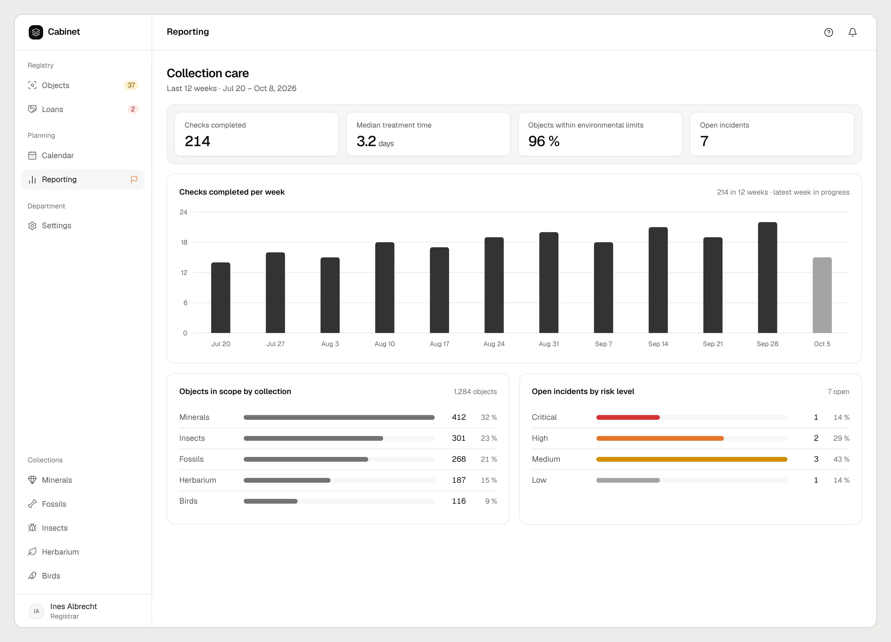 | 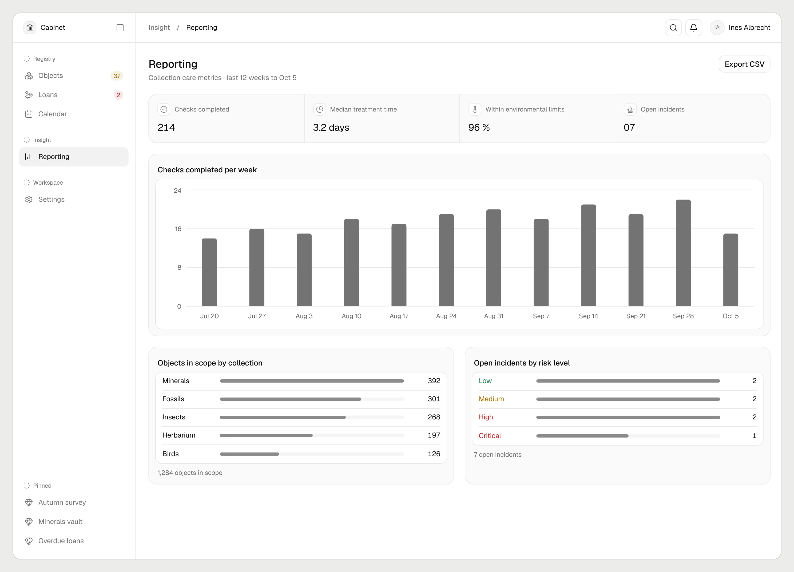 | 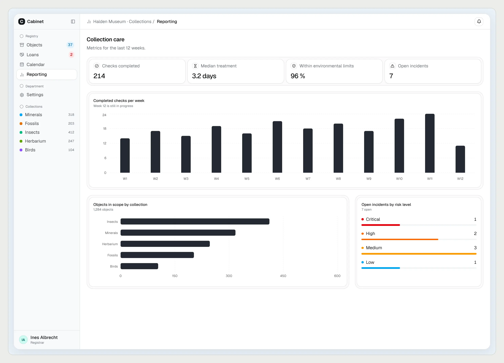 |

### Settings

| Dossier, words only                                                                                                   | Dossier, with the base sentence                                                                                                  | Screenshots, with the base sentence                                                                  |
| --------------------------------------------------------------------------------------------------------------------- | -------------------------------------------------------------------------------------------------------------------------------- | ---------------------------------------------------------------------------------------------------- |
| 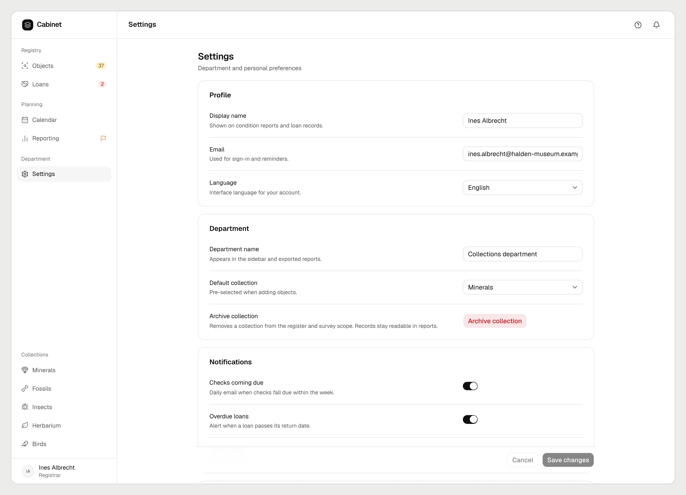 | 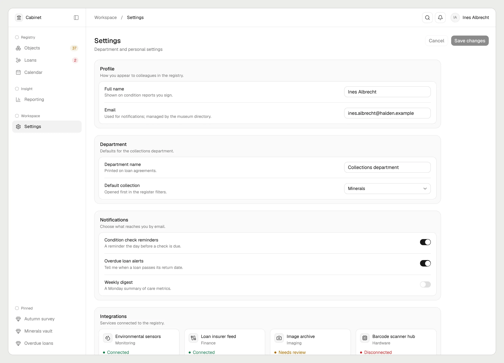 | 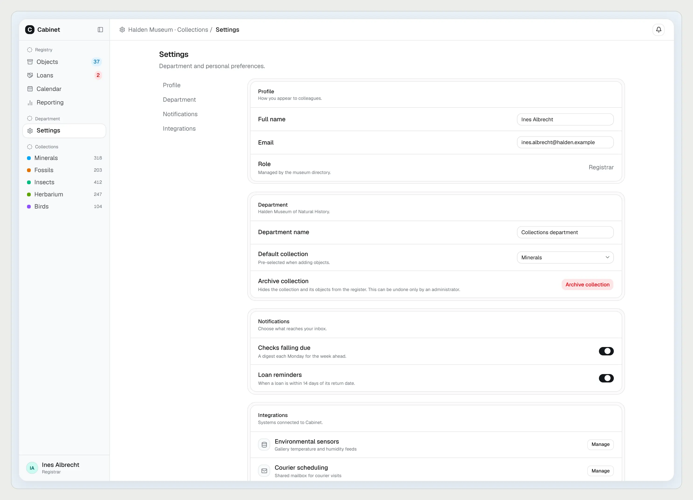 |

## Runs

Times and list cost from `run.json`; usage includes subagents.

| Run                       | Input                                      | Wall time    | List cost    |
| ------------------------- | ------------------------------------------ | ------------ | ------------ |
| Extract 1                 | Two screenshots, the person's words        | 5.6 min      | $1.42        |
| Extract 2                 | The same, plus the base sentence           | 7.1 min      | $1.99        |
| Dossier 1, runs 1 and 2   | Dossier from extract 1                     | 4.7, 4.2 min | $1.04, $0.91 |
| Dossier 2, runs 1 and 2   | Dossier from extract 2                     | 4.4, 4.6 min | $0.90, $1.07 |
| Screenshots, runs 1 and 2 | Screenshots and the words, one per wording | 2.8, 3.3 min | $0.56, $0.72 |
| None                      | No visual reference                        | 2.6 min      | $0.52        |

## Limits

- **No blind review yet:** the results above come from reading the captures, not from the [rubric](../benchmarks/next-shadcn/rubric.md) applied blind. Routing verdicts were not scored.
- **Small samples:** two dossier runs per extraction and one screenshot run per wording.
- **The base sentence was added by the operator:** the person's own sentences produced `only`. Whether another person would phrase it the same way is not tested.
- **No charts source:** neither screenshot shows a chart, so chart marks stayed `unknown` and were invented.
- **The loans route stayed a table** in every run. The brief does not ask for cards there, so card anatomy shows mainly on settings.
